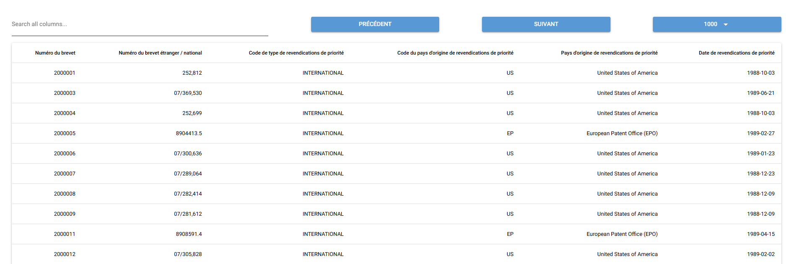

# Introduction
Afin de tester la surcharge avec Docker, il est nécessaire de mettre en place une interface Web avec un service API. Ces deux composantes ont été développées avec Python.

# Intélligence Artificielle
Ce code a été partiellement corrigé, optimisé et débogué à l’aide d’une intelligence artificielle (ChatGPT et Gemini). Bien que des efforts aient été faits pour garantir sa fiabilité, il est recommandé de le tester soigneusement dans votre environnement avant toute mise en production.

# Python-frontend
## Explication
Le frontend permet d'afficher le contenu soit du [jeu de données](SQL/Dataset/PT_priority_claim_2000001_to_4000000_2024-10-11.csv) disponible dans le projet ou le contenu fourni par l'API du backend. L'interface utilise la librairie Python NiceGui puisqu'elle est simple et rapide à utiliser. 

## Variables d'environnement
| Variables | Explication |
| -------- | -------- |
|PYTHON_FRONTEND_CSV_PATH| Chemin d'accès au jeu de données |
|PYTHON_FRONTEND_RECORDS_PER_PAGE| Nombre de ligne d'afficher par défaut dans l'interface |
|PYTHON_FRONTEND_API_URL| URL de l'API Backend |

## Module Python
La liste des modules Python est disponible dans le fichier [requirements.txt](Python/python-frontend/requirements.txt).


Le fichier a été généré avec la commande suivante:
```
pip freeze > requirements.txt
```

## Déploiement manuel
Voici les commandes pour déployer le frontend manuellement:

```
cd Python/python-frontend
python3 -m venv venv
source venv/bin/activate
pip install -r requirements.txt
python3 src/main.py
```

## Déploiement automatisé
Un script est disponible afin de faire le déploiement automatiquement. Le script inclu les variables d'environnement.

```
cd Python/python-frontend
source setup.sh
python3 src/main.py
```

## Fonctionnement de l'interface
L'interface affiche par défaut le nombre de résultat selon la variable PYTHON_FRONTEND_RECORDS_PER_PAGE. L'interface permet de faire une recherche, d'aller au prochain résultat ou de reculer. De plus, il est possible de change le nombre de résultat entre 10, 100, 1000 et 10000.




